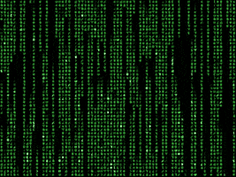

<h1>Olá, eu sou o Luiz Felipe 👋</h1>

<h3>Como me contar:</h3>

    

<h2>👨🏻‍💻 Sou um estudante apaixonado por tecnologia, cursando Engenharia de Software na UTFPr, localizada em Dois Vizinhos-PR. 

</h2>

### Skils: 

 

 
 

